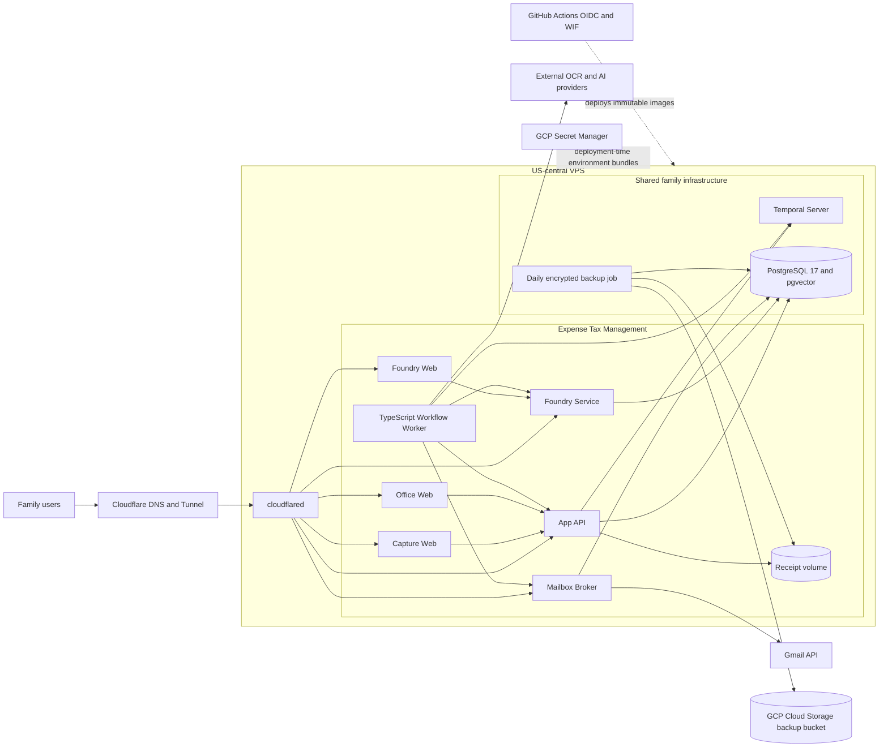
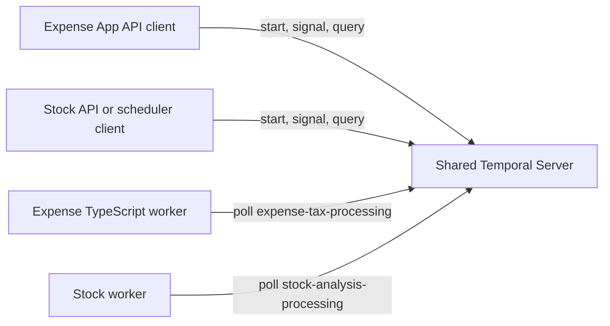

# Family App Runtime Architecture

> **Status:** Approved target architecture
> **Last updated:** 2026-09-20
> **Scope:** Expense Tax Management plus future family applications sharing one VPS

## Decisions

- Run every application service, frontend, Temporal worker, Temporal server, and
  PostgreSQL database on one US-central VPS.
- Use GCP only for Secret Manager, IAM, GitHub OIDC/WIF deployment identity,
  Terraform state, and encrypted off-host backups in Cloud Storage.
- Use TypeScript for canonical application services and Temporal workers.
- Keep one shared Temporal server under root infrastructure.
- Keep each worker inside its owning project as a separate package, image,
  process, identity, namespace, and task queue.
- Keep PostgreSQL self-hosted. Neon and Cloud SQL are not part of the target.
- Keep receipt files on a dedicated VPS volume and back them up to GCS daily.
- Run no OCR, embedding, LLM, or other model inference on the VPS. Workers call
  provider-neutral external APIs selected through Foundry.
- Defer Graphiti, Neo4j, and other graph infrastructure until measured PostgreSQL
  queries prove a graph database necessary.
- Accept single-VPS availability with tested restoration onto a replacement VPS.

## Target Topology



No application request depends on a GCP compute service. Cloudflare is public
ingress. Gmail and AI/OCR providers are external application dependencies.

## Project Layout

```text
family-app/
  infrastructure/
    temporal/                       # shared server configuration and namespaces
    postgres/                       # shared cluster bootstrap and roles
    backup/                         # database and receipt backup/restore tooling
    vps/                            # provider-portable host bootstrap

  expense-tax-management/
    frontend/
      capture-web/
      office-web/
      foundry-web/
    services/
      app-api/
      foundry-service/
      mailbox-broker/
      workflow-worker/              # expense-owned workflows and activities
    packages/contracts/             # canonical Zod transport contracts

  stock-analysis/
    services/
      api/
      workflow-worker/              # stock-owned workflows and activities
```

Root production deployment may compose every image, but source ownership remains
domain-local. Folder placement does not control CPU or memory; container limits and
worker concurrency do.

## Temporal Model



Temporal roles:

| Component | Responsibility | Location |
|---|---|---|
| Server | Persists workflow history, timers, schedules, and task queues | `infrastructure/temporal/` |
| Client | Starts, signals, queries, and cancels workflows | Owning project backend |
| Worker | Executes domain workflows and activities | Owning project service |
| Namespace | Logical project isolation and retention | One per family project |
| Task queue | Routes work to matching workers | One or more per project |

Approved initial boundaries:

| Project | Namespace | Primary task queue |
|---|---|---|
| Expense Tax Management | `expense-tax` | `expense-tax-processing` |
| Stock Analysis | `stock-analysis` | `stock-analysis-processing` |

The Temporal server contains no expense or stock business logic. A stopped worker
does not lose accepted work; tasks remain durable until the matching worker returns.
Workers use distinct service credentials and cannot access another project's API.

Do not create one package or image containing every family's workflows. A future
shared TypeScript Temporal utility package may contain connection setup, logging,
interceptors, health checks, and test helpers only after real duplication appears.
It must never contain domain workflows, activities, provider credentials, or
contracts.

## Expense Service Boundaries

| Component | Owns | Does not own |
|---|---|---|
| App API | Customer domain, authorization, expenses, receipts, tags, tax data, mailbox metadata | Provider credentials, workflow execution |
| Foundry Service | Provider catalog, routes, quotas, reservations, and telemetry | Customer expense tables |
| Mailbox Broker | Gmail OAuth exchange, encrypted token vault, Gmail calls | Expense mutation, tenant authorization decisions |
| Workflow Worker | Durable orchestration and external activities | Direct App, Foundry, or mailbox database writes |
| Web applications | Presentation and authenticated API calls | Domain persistence |

App API and Foundry retain independent runtime and migration database roles. Worker
activities call authenticated internal APIs for state transitions; they never write
service-owned tables directly.

## TypeScript Worker Boundary

The currently deployed worker is Python. Approved migration replaces it with a
standalone TypeScript workspace and container; it does not embed worker polling in
App API.

```text
services/workflow-worker/
  src/worker.ts
  src/workflows/
  src/activities/
  src/clients/
  test/
```

- App API keeps only `@temporalio/client` and its narrow injectable starter.
- Worker owns `@temporalio/worker`, workflow code, activities, and service clients.
- `packages/contracts` supplies Zod workflow inputs/results plus stable queue and
  workflow names.
- Workflow code remains deterministic and isolated from Node-only I/O.
- Activities perform HTTP, file, Gmail, OCR, and AI provider operations.
- Worker image deploys and rolls back independently from App API.
- Before cutover, pause schedules and new dispatch, then keep Python worker running
  until every accepted old-queue workflow reaches a terminal state.

The detailed migration sequence lives in
[runtime-typescript-temporal-migration.md](sub-plans/runtime-typescript-temporal-migration.md).

## PostgreSQL and File Storage

One PostgreSQL cluster serves family projects through separate databases and
least-privilege roles. Initial databases include:

- App runtime and migration databases/roles.
- Foundry runtime and migration databases/roles.
- Mailbox token-vault database/role.
- Temporal persistence and visibility databases/roles.
- Separate databases for future family projects such as Stock Analysis.

Receipt images and PDFs never live in PostgreSQL. The primary copy remains on a
dedicated VPS volume behind App API's storage adapter. Objects are immutable after
confirmation; database rows reference only confirmed objects. GCS is backup storage,
not the live receipt-serving path.

## Secrets and OAuth Tokens

GCP Secret Manager stores versioned environment bundles. GitHub Actions authenticates
with OIDC/WIF, fetches the approved bundle during deployment, and copies a root-only
runtime file to the VPS. Secret Manager centralizes storage and rotation; it does not
protect a secret after that secret reaches a compromised VPS.

Use separate bundles for host infrastructure and each family project. Do not share
one unrestricted environment file across Expense and Stock workers.

Gmail refresh tokens are dynamic customer credentials, not environment variables.
Mailbox Broker stores them in a dedicated PostgreSQL vault as AES-256-GCM ciphertext
with nonce, key ID, and token generation. The active key comes from the Expense
Secret Manager bundle. App API stores only connection metadata and an opaque vault
reference. Access tokens exist only in broker memory. This design accepts that full
VPS compromise can expose both ciphertext and runtime key.

## Backup and Recovery

Daily backup covers all state required to rebuild a replacement VPS:

- PostgreSQL globals and every application, mailbox, Temporal, and visibility
  database.
- Confirmed receipt files and durable inbound files on VPS volumes.
- Immutable image tags, migration versions, and deployment manifest.
- Checksums and an inventory manifest.

Backups are encrypted on the VPS with an `age` public recipient before upload. The
private recovery identity stays outside the VPS in Secret Manager and operator
custody. The runtime backup identity has GCS object-creator access only; it cannot
read, overwrite, or delete backups. Bucket retention and lifecycle rules protect
history.

Target recovery objectives:

| Objective | Target |
|---|---|
| RPO | At most 24 hours; normal backup attempts run every 12 hours |
| RTO | Under 2 hours after automation and restore drills pass |
| Integrity check | Every backup through checksum and archive validation |
| Restore drill | Monthly disposable-host restore; quarterly full cutover rehearsal |

Database dumps run before receipt archive capture. Because App API confirms a receipt
only after its immutable file exists, every file referenced by the database snapshot
is available for that backup cycle. Physical file deletion must wait beyond backup
retention.

Secrets are not copied into the backup bucket. Restore retrieves current environment
bundles from Secret Manager. Full implementation plan:
[vps-backup-and-restore.md](sub-plans/vps-backup-and-restore.md).

## Runtime Sizing

Approved production starting point is 8 vCPU/16 GB. A 4 vCPU/8 GB host remains a
pilot option only after production-like measurements prove sufficient headroom.

Current Expense containers declare about 5.5 vCPU and 5.5 GB combined ceilings
before PostgreSQL, OS, Cloudflare, backups, deploy-time migrations, or future Stock
workers. Limits are ceilings rather than reservations, but 8 GB leaves little safe
deployment and recovery margin.

Initial worker limits:

| Worker | CPU | Memory | Notes |
|---|---:|---:|---|
| Expense workflow worker | 0.5 vCPU | 512 MB | Mostly I/O-bound external activities |
| Stock workflow worker | 0.5-1 vCPU | 512 MB-1 GB | Increase only from measurement |

CPU-heavy stock calculations belong in isolated activities or a dedicated processor
container with explicit limits. Temporal workflow code must not perform heavy numeric
work.

Scale the VPS or split a measured bottleneck when steady memory exceeds 65%, CPU p95
exceeds 70%, swap appears, PostgreSQL latency degrades, or deployments fail health
checks.

## Latency and Failure Characteristics

- Core container and PostgreSQL traffic stays on one Docker host with no platform
  cold starts.
- Same-host network overhead should remain sub-millisecond; handler and query work
  dominate.
- Cloudflare/user geography determines public request latency.
- Gmail and external OCR/AI calls may take hundreds of milliseconds to tens of
  seconds and therefore run as durable activities.
- VPS loss stops every application until restore; GCP backups and Secret Manager
  survive independently.
- One worker failure affects only its task queues. Other projects and HTTP APIs stay
  available.

## Portability Rules

- Build every deployable as an immutable OCI image.
- Keep provider-neutral runtime configuration and health checks.
- Keep one root production composition that can target any Ubuntu VPS.
- Keep PostgreSQL schema portable and migrations service-owned.
- Keep external storage, mailbox, OCR, and AI providers behind interfaces.
- Keep GCP SDKs out of domain packages except backup/deployment adapters.
- Test backup restoration before the February 2027 VPS provider change.

## Explicitly Excluded

- Cloud Run, Cloud Functions, Cloud SQL, GKE, and always-on GCP compute.
- Neon PostgreSQL for production.
- One central worker package containing unrelated family domains.
- Python-generated transport contracts after worker migration.
- VPS-hosted OCR, embeddings, LLMs, or GPU workloads.
- Production graph database until an evidence gate is approved.
