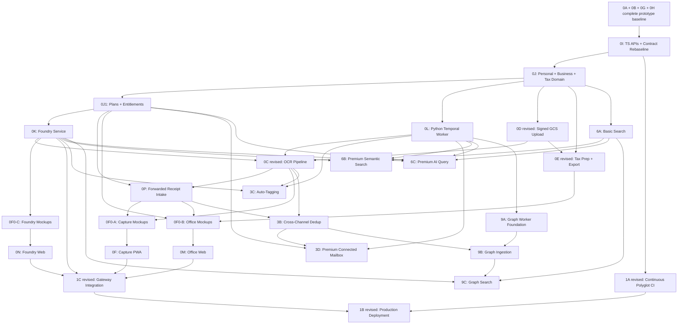

# 📋 Expense Tax Management — Master Plan

> **Project**: Expense Tax Management System (monorepo)
> **Inspired by**: [TaxHacker](https://github.com/vas3k/TaxHacker) (v0.8.5, Next.js + Prisma + PostgreSQL)
> **Status**: Pre-infrastructure source phases and Phase 1A CI complete; deployment gate closed
> **Last Updated**: 2026-09-09

---

## 🎯 Vision

A self-hosted, AI-powered expense management system for households, freelancers, and small businesses, enabling:
- **Focused receipt capture** through a phone/tablet PWA with camera, offline queue, file upload, and secure email forwarding
- **Profile-aware expense attribution** where one tenant has one Personal profile and multiple small businesses with explicit memberships
- **Project cost analysis** for business clients and internal initiatives without treating projects as tax entities
- **US-federal tax preparation and deterministic export** by business and tax year, with no direct tax filing
- **Laptop-focused office workflows** for dashboards, dense expense review, tax analysis, search, and exports
- **Platform-operated AI Foundry** for provider/model routing, curated user modes, secrets, health, and per-tenant quotas
- **Tiered features**: forwarding for every plan; connected mailbox scans and AI search as premium entitlements/add-ons
- **Multi-modal search**: basic SQL/full-text for all plans, with premium semantic and natural-language search
- **Durable Python Temporal workflows** for OCR, AI, email ingestion, deduplication, auto-tagging, and later graph enrichment

---

## 🏗️ Architecture Overview

```text
Capture PWA ---------\
                      +--> App API (TypeScript, Fastify, Zod) --> app PostgreSQL
Office Web -----------/              |
                                     +--> Temporal TypeScript client
                                               |
                                               v
                                      Python Temporal AI Worker --> GCS
                                                |             |
                                                |             +--> App API callbacks
                                                +--> Foundry internal API
                                                +--> Secret Manager (route-scoped reads)

Foundry Web ----------------> Foundry Service (TypeScript, Fastify, Zod)
                                      |                 |
                                      v                 v
                              foundry PostgreSQL   Secret Manager
```

Capture, Office, and Foundry are separate Next.js applications. App API owns customer-domain persistence. Foundry owns AI catalog, routing, quotas, and telemetry. Python workers own durable workflow execution and AI/data processing, but do not mutate service-owned tables directly.

Approved platform architecture: [Phase 0I Polyglot Platform Rebaseline](sub-plans/phase-0i-polyglot-platform-rebaseline-design.md). Phase 0J domain architecture: [Personal, Business, Project, and Tax Domain Design](sub-plans/phase-0j-personal-business-tax-domain-design.md). All four Phase 0J local waves are complete; infrastructure gate remains.

---

## 🗂️ Milestones & Phases

### Milestone 0 — Core Expense Management (MVP) ⬅️ **CURRENT FOCUS**
> **Goal**: Rebaseline service ownership, then deliver capture, business-aware expenses, tax preparation/export, Foundry controls, and split frontends.

| Phase | Description | Status | Sub-Plan |
|-------|-------------|--------|----------|
| **0A** | Project Bootstrap & Monorepo Setup | ✅ Complete | [phase-0a-project-setup.md](sub-plans/phase-0a-project-setup.md) |
| **0B** | Prototype Core Data Model & Database | ✅ Complete (historical baseline) | [phase-0b-data-model.md](sub-plans/phase-0b-data-model.md) |
| **0I** | TypeScript APIs & Polyglot Contract Rebaseline | ✅ Complete | [design](sub-plans/phase-0i-polyglot-platform-rebaseline-design.md) · [execution plan](sub-plans/phase-0i-polyglot-platform-rebaseline-implementation.md) |
| **0J** | Personal, Small Business, Project & Tax Domain Reframe | ✅ Local implementation complete; infrastructure gate | [design](sub-plans/phase-0j-personal-business-tax-domain-design.md) · [agent rules](../AGENTS.md) |
| **0J1** | Tenant Plans, Add-ons & Entitlements | ✅ Local implementation complete; infrastructure gate | [implementation](sub-plans/phase-0j1-plans-entitlements-implementation.md) |
| **0K** | AI Foundry Service & Runtime Quotas | ✅ Local implementation complete (Waves A+B); infrastructure gate | [Wave A](sub-plans/phase-0k-wave-a-catalog-implementation.md), [Wave B](sub-plans/phase-0k-wave-b-quotas-reservations-implementation.md) |
| **0L** | Python Temporal AI Worker Foundation | ✅ Local implementation complete; infrastructure gate | [implementation plan](sub-plans/phase-0l-temporal-worker-foundation-implementation.md), [0I design section 4.3](sub-plans/phase-0i-polyglot-platform-rebaseline-design.md#43-python-worker-ownership) |
| **0D** | Direct Cloud Storage & Signed Uploads (revised) | ✅ Local implementation complete; infrastructure gate | [implementation plan](sub-plans/phase-0d-uploads-storage-implementation.md) (replaces [stale plan](sub-plans/phase-0d-cloud-storage.md)) |
| **0C** | Receipt Upload & OCR Pipeline (revised) | ✅ Local implementation complete; infrastructure gate | [implementation plan](sub-plans/phase-0c-ocr-pipeline-implementation.md) (replaces [stale plan](sub-plans/phase-0c-ocr-pipeline.md)) |
| **0E** | Business Tax Preparation, Project Analysis & Export (revised) | ✅ Local implementation complete; infrastructure gate | [implementation plan](sub-plans/phase-0e-reports-exports-implementation.md) (replaces [stale plan](sub-plans/phase-0e-project-tax.md)) |
| **0P** | Secure Forwarded Receipt Intake | ✅ Local implementation complete; provider adapters gated | [implementation plan](sub-plans/phase-0p-forwarded-intake-implementation.md), [0I design section 12](sub-plans/phase-0i-polyglot-platform-rebaseline-design.md#12-forwarded-receipt-intake) |
| **0F0** | Three App-Specific UI Mockup Gates | ✅ Capture, Office, Foundry approved | [review](mockups/rebaseline/REVIEW.md), [plan](sub-plans/phase-0f0-web-ui-mockups.md) |
| **0F** | Capture PWA (phone/tablet only) | ✅ Local implementation complete; identity/deployment gate | [implementation](sub-plans/phase-0f-capture-pwa-implementation.md) |
| **0M** | Office Web (laptop reporting/tax/export) | ✅ Local implementation complete; identity/deployment gate | [implementation](sub-plans/phase-0m-office-web-implementation.md) |
| **0N** | Foundry Web (authorized platform staff only) | ✅ Local implementation complete; platform identity/deployment gate | [implementation](sub-plans/phase-0n-foundry-web-implementation.md) |
| **0G** | Repository Structure & Prototype Python Contracts | ✅ Complete (contract ownership superseded) | [phase-0g-repository-structure-shared-contracts.md](sub-plans/phase-0g-repository-structure-shared-contracts.md) |
| **0H** | Family-App Monorepo & Shared Infrastructure | ✅ Complete | [phase-0h-family-infra-split.md](sub-plans/phase-0h-family-infra-split.md) |

---

### Milestone 1 — CI/CD, Deployment & API Gateway
> **Goal**: Automated polyglot CI, reproducible container deployment, and defense-in-depth gateway authentication. App API and Foundry still enforce service authorization and resource ownership.

| Phase | Description | Status | Sub-Plan |
|-------|-------------|--------|----------|
| **1A** | Polyglot GitHub Actions CI (revised) | ✅ Complete; continuous gate | [implementation](sub-plans/phase-1a-polyglot-ci-implementation.md) (replaces [stale plan](sub-plans/phase-1a-cicd-pipeline.md)) |
| **1B** | Production Container Deployment (revised) | ⏸️ After clients and gateway integration | [phase-1b-vps-deployment.md](sub-plans/phase-1b-vps-deployment.md) |
| **1C** | Defense-in-Depth Gateway Authentication (revised) | ⚪ Replan after 0I; release gate | [phase-1c-gateway-auth.md](sub-plans/phase-1c-gateway-auth.md) |

---

### Milestone 3 — Premium Ingestion Expansion & Auto-Tagging
> **Goal**: Expand Phase 0L/0P workflows with premium connected-mailbox scanning, cross-channel deduplication, auto-tagging, and enrichment.

| Phase | Description | Sub-Plan |
|-------|-------------|----------|
| **3A** | Advanced Temporal Workflow Expansion (foundation moved to 0L) | [phase-3a-temporal-setup.md](sub-plans/phase-3a-temporal-setup.md) |
| **3B** | Deduplication & Conflict Resolution | [phase-3b-deduplication.md](sub-plans/phase-3b-deduplication.md) |
| **3C** | Auto-Tagging & Categorization Pipeline | [phase-3c-auto-tagging.md](sub-plans/phase-3c-auto-tagging.md) |
| **3D** | Premium Connected Mailbox Scanning (Gmail, later Outlook) | [phase-3d-email-scanning.md](sub-plans/phase-3d-email-scanning.md) |

---

### Milestone 6 — Basic Search & Premium AI Query
> **Goal**: Keep SQL/full-text search broadly available; gate semantic and natural-language AI search by tenant entitlement and monthly Foundry quota.

| Phase | Description | Sub-Plan |
|-------|-------------|----------|
| **6A** | Full-Text & Advanced SQL Search (base feature) | [phase-6a-sql-search.md](sub-plans/phase-6a-sql-search.md) |
| **6B** | Semantic Search (premium `ai_search`) | [phase-6b-semantic-search.md](sub-plans/phase-6b-semantic-search.md) |
| **6C** | Natural-Language AI Query (premium; trial 20/month) | [phase-6c-ai-query.md](sub-plans/phase-6c-ai-query.md) |

---

### Milestone 9 — Graph RAG & Knowledge Graph
> **Goal**: Build a temporal knowledge graph of expenses for relational, contextual queries.

| Phase | Description | Sub-Plan |
|-------|-------------|----------|
| **9A** | Neo4j + Graphiti Setup | [phase-9a-graph-setup.md](sub-plans/phase-9a-graph-setup.md) |
| **9B** | Expense Graph Ingestion | [phase-9b-graph-ingestion.md](sub-plans/phase-9b-graph-ingestion.md) |
| **9C** | Graph Search & Query API | [phase-9c-graph-search.md](sub-plans/phase-9c-graph-search.md) |

---

### Milestone 12 — Mobile App (Deferred — PWA First)
> **Goal**: Dedicated mobile app targeting Android (and iOS). We may use Flutter for the Android app; we are not decided yet and it may not be Expo React Native. PWA in Phase 0F covers mobile scanning initially.

| Phase | Description | Sub-Plan |
|-------|-------------|----------|
| **12A** | Mobile App Architecture & Setup (Flutter evaluation for Android) | [phase-12a-android-setup.md](sub-plans/phase-12a-android-setup.md) |
| **12B** | Mobile Camera & Receipt Capture | [phase-12b-android-camera.md](sub-plans/phase-12b-android-camera.md) |
| **12C** | Mobile API Sync & Offline Mode | [phase-12c-android-sync.md](sub-plans/phase-12c-android-sync.md) |

---

## 🧰 Technology Stack (TypeScript APIs + Python AI Workers)

| Layer | Technology | Version | Rationale |
|-------|-----------|---------|-----------|
| **Client Frontends** | Three Next.js applications | **16.3+** | Separate Capture PWA, Office Web, and Foundry Web responsibilities. |
| **UI Library** | React | **19.2+** | Component state, optimistic UI updates, transitions |
| **Styling** | Tailwind CSS + Radix UI | **v4.3+** | CSS-first `@theme` engine, sleek dark mode, mobile responsiveness |
| **PWA Engine** | `@serwist/next` | Latest | Service Worker shell caching, offline receipts, camera permissions |
| **Customer App API** | Node.js + Fastify + Zod | Current LTS / latest compatible | IO-focused customer API, runtime schemas, typed contracts, portable serverless adapter. |
| **Foundry Service** | Node.js + Fastify + Zod | Current LTS / latest compatible | Isolated provider/model catalog, quotas, reservations, telemetry, and platform APIs. |
| **Contract Source** | Zod v4 -> OpenAPI/JSON Schema | Current | Generates frontend clients and Python Pydantic DTOs; no manually duplicated contracts. |
| **Python Runtime** | Python | **3.14 / 3.13** | Temporal workflows, OCR/AI, image/PDF processing, and future Graphiti. |
| **TypeScript Data Access** | PostgreSQL driver + service-owned query/migration layer | Current | App API and Foundry own separate schemas; exact library is selected and validated in Phase 0I. |
| **Python Validation** | Generated Pydantic v2 DTOs | **2.x** | Validates cross-language workflow/internal API payloads generated from canonical schemas. |
| **Primary Database** | PostgreSQL + pgvector | **Postgres 17+** (`pgvector:pg17`) | ACID storage, native `tsvector` FTS, HNSW vector similarity |
| **Workflow Engine** | Temporal TypeScript client + Python SDK + Server | Current compatible releases | TypeScript starts named workflows; Python executes durable workflows and activities on dedicated queues. |
| **Graph Framework** | Graphiti (`graphiti-core`) | **0.30.1+** | Native in-process Python integration, temporal knowledge graph |
| **Graph Database** | Neo4j Community / FalkorDB | **Neo4j 5.26+** / **FalkorDB** | Temporal relationship storage, direct Cypher queries via Python driver |
| **OCR & Vision AI** | Python adapters behind Foundry routes | Latest | Curated user modes, per-tenant operation/model quotas, internal provider cost controls. |
| **Email Scanning** | Gmail API, then Microsoft Graph adapter | Latest compatible | Premium connected-mailbox discovery through Python Temporal activities. |
| **File Storage** | Google Cloud Storage (Node.js + Python SDKs) | Current compatible | App API issues signed upload sessions; workers read immutable objects through route-scoped access. |
| **Image Processing** | Pillow / OpenCV | Latest | In-process receipt deskewing, edge detection, and compression |
| **Gateway / Ingress** | Traefik | **v3.3+** | Automatic HTTPS, routing, coarse access policy, rate limiting, and service discovery. Services retain authorization enforcement. |
| **Containerization** | Docker + Docker Compose | **Compose v2.33+** | Dev on macOS, Prod on Ubuntu self-hosted |
| **Future Mobile** | Flutter (Dart) | **3.27+** | Prime candidate for future Android app (single codebase for Android & iOS, native camera, undecided yet and may not be Expo React Native) |

---

## 📁 Monorepo Structure (Rebaseline Target)

```text
family-app/
|-- infrastructure/                 # Shared PostgreSQL, Temporal, gateway, observability
`-- expense-tax-management/
    |-- frontend/
    |   |-- capture-web/             # Phone/tablet Next.js PWA
    |   |-- office-web/              # Laptop Next.js reporting/tax/export app
    |   `-- foundry-web/             # Platform-operator Next.js app
    |-- services/
    |   |-- app-api/                 # TypeScript Fastify customer/domain API
    |   |-- foundry-service/         # TypeScript Fastify AI control plane
    |   `-- ai-worker/               # Python Temporal workflows and AI activities
    |-- packages/contracts/          # Canonical Zod contracts and generated schemas
    |-- common/python/expense-contracts/ # Generated Pydantic transport artifacts
    |-- plans/
    |-- opencode.json
    `-- .opencode/
```

---

## 🔑 Key Design Decisions

### 1. Three Next.js Clients + TypeScript APIs + Python Workers
- **Decision**: Build separate Capture, Office, and Foundry Next.js applications. Use TypeScript Fastify services for HTTP APIs and database ownership. Keep Python for Temporal and AI/data-processing workers.
- **Client role**: Presentation-only applications consume generated clients from service OpenAPI documents.
- **TypeScript role**: App API owns customer-domain behavior and data; Foundry owns AI catalog, routing, quotas, and telemetry.
- **Python role**: Durable workflows, OCR/LLM execution, image/PDF processing, premium mailbox discovery, and later Graphiti. Workers submit idempotent results through internal APIs rather than writing service tables.
- **What we adopt from TaxHacker**:
  - UI components and layout patterns (Radix UI + Tailwind)
  - Data model concepts (User, Expense, File, Category, Project)
  - Extraction prompts and receipt field structures

### 2. Graph RAG: Native Python Graphiti
- **Decision**: Run [Graphiti](https://github.com/getzep/graphiti) natively in isolated Python worker activities.
- **Rationale**: No separate Graphiti sidecar is needed. Workers use the native graph driver and return versioned results through App API callbacks; they never read or mutate App API tables directly.
- **Graph DB choice**: Follow Graphiti's preferred backend (currently Neo4j 5.26+ or FalkorDB).

### 3. Search Architecture (Layered)
- **Layer 1 — SQL Filters**: PostgreSQL exact filters (date, amount, category, project, tags) through the App API service-owned data layer
- **Layer 2 — Full-Text Search**: PostgreSQL `tsvector` for keyword search in receipt text
- **Layer 3 — Semantic Search**: pgvector embeddings for similarity search ("expenses like my office supplies")
- **Layer 4 — Graph Search**: Graphiti/Neo4j for relational queries ("What did I buy at Costco for my home office?")
- **Layer 5 — AI Query**: LLM rewrites natural language → structured query plan dispatched to layers 1-4

### 4. Ingestion Pipeline: TypeScript Client + Temporal Python Worker
- **Decision**: App API starts named workflows through the Temporal TypeScript client; dedicated Python task queues execute workflows and AI activities.
- **Rationale**: API and persistence remain TypeScript-owned while Python keeps its AI ecosystem. JSON-compatible generated contracts and internal idempotent callbacks form the language boundary.

### 5. Email Receipt Scanning: Provider Adapters + Temporal Schedules
- **Decision**: Premium connected scanning starts with the official Gmail API Python client; Microsoft Graph follows through the same worker adapter contract. Temporal schedules orchestrate discovery.
- **Rationale**: Cross-channel dedup: when a user scans a receipt manually and the same receipt arrives via email, the system detects a Personal/business-scoped duplicate and links provenance without crossing profile authorization boundaries.

### 6. File Storage: Google Cloud Storage
- **Decision**: GCS over local filesystem
- **Rationale**: Scalable, CDN-ready, handles large receipts/PDFs, lifecycle policies for cost management
- **Local dev**: Use a GCS emulator or fake object-storage adapter behind the same signed-upload contract.

### 7. Tenant, Business, Project, and Tax Boundaries
- **Decision**: Tenant is subscription/account boundary. Tenant contains one Personal profile and one or more small businesses. Users require explicit membership for Personal or each business; tenant administration grants no implicit expense access.
- **Implementation**: Business owns tax profile and tax reporting. Project belongs to one business and exists only for client/job cost analysis. Spending category and tax category are separate concepts.
- **Active profile**: Login selects Personal or a business for UI context; every mutation still carries explicit IDs and passes server authorization.

### 8. Deployment: Ubuntu Self-Hosted + Docker
- **Decision**: All deployable services (Next.js, Fastify, Python worker, PostgreSQL, FalkorDB, Temporal, and Traefik) run via Docker Compose on an Ubuntu VPS. Graphiti remains a Python library, not a separate service.
- **Dev**: macOS (this MacBook) with Docker Desktop
- **Prod**: OVH VPS (12 GB RAM), portable to another VPS or serverless-container provider via IaC (see [ROADMAP.md](ROADMAP.md)).
- **Gateway**: Traefik API gateway in front of all services for routing, automatic TLS, gateway-level AuthN/AuthZ (ForwardAuth), rate limiting, and zero-config Docker service discovery.

### 9. AI Foundry, Curated Modes, and Quotas
- **Decision**: Platform operators configure providers, secret references, models, curated modes, routing, quotas, and safety limits in Foundry.
- **User contract**: Tenant users see curated modes and remaining jobs only. They never manage provider keys, model IDs, routes, or arbitrary prompts.
- **Metering**: One provider-accepted receipt/document consumes at most one OCR product credit. One provider-accepted premium AI-search request consumes at most one search credit. Internal retries/calls are separately logged without charging another product credit.
- **Trial**: AI search permits 20 shared consumed tenant requests per calendar month.

### 10. Split Frontend Responsibilities
- **Capture PWA**: Phone/tablet camera, files, offline queue, quick review, Personal/business context, curated OCR mode, and secure forwarding address.
- **Office Web**: Laptop dashboard, ledger, businesses, projects, tax preparation, exports, inbox controls, plans, and premium AI search.
- **Foundry Web**: Platform-only provider/model/mode/quota/health/audit operations with separate operator and quota-reconciler permissions.

### 11. Email Receipt Tiers
- **Forwarding**: Every plan can forward to one physical inbound route using opaque virtual tokens bound to tenant, Personal/business profile, and verified sender.
- **Connected scanning**: Gmail/Outlook mailbox access requires Team/Enterprise entitlement or premium add-on.
- **Security**: Webhook signatures, sender verification, email authentication results, quarantine, rate limits, attachment validation, malware scanning, deduplication, and token rotation run before OCR.

### 12. Tax Product Boundary
- **Decision**: Prepare, review, and export US-federal business expense records. Never submit federal/state returns or store e-file credentials.
- **Integration path**: Canonical deterministic bundle first; tax-software-compatible adapters or connected apps later.

### 13. Mobile Strategy: Next.js PWA First, Flutter Candidate for Future Android App
- **Decision**: Build the web app as a client-side **PWA (Progressive Web App)** with camera access for receipt scanning on mobile. In the future (Milestone 12), for a dedicated mobile app, we **may use Flutter for the Android app (and may not be Expo React Native, as we are not decided yet)**.
- **PWA capabilities**: HTML5 camera capture (`getUserMedia` and `<input capture="environment">`), offline indicator, home screen install, push notifications.
- **Flutter consideration**: Generated OpenAPI contracts make mobile transport language-neutral. Flutter remains a candidate for high-performance camera/document scanning and offline storage; framework selection stays deferred until Milestone 12.

### 14. Gmail OAuth: Full Verification
- **Decision**: Pursue full Google OAuth verification from the start. Existing GCP project and OAuth client already set up.
- **Timeline**: Verification takes 2-6 weeks; start the process during Milestone 3 development.

### 15. Email Scan Depth
- **Decision**: Default to **last 30 days** on first connect. User can choose a custom range, capped at **90 days maximum**.
- **Rationale**: 30 days balances coverage vs. LLM cost. 90-day cap prevents runaway costs on first connect.

---

## ✅ Resolved Decisions (formerly Open Questions)

| # | Question | Decision |
|---|----------|----------|
| 1 | Backend architecture | **TypeScript Fastify App API + TypeScript Fastify Foundry Service + Python Temporal AI worker**. Three separate Next.js frontends. |
| 2 | Temporal hosting & SDK | **TypeScript Temporal client starts Python workflows** on dedicated queues; Temporal remains self-hosted initially. |
| 3 | LLM/OCR strategy | **Foundry-operated providers/models behind curated user modes**. Fixed per-tenant model/operation job allowances plus internal cost controls. |
| 4 | Multi-tenancy | **Tenant is account/subscription boundary with one Personal profile and multiple businesses; every data scope requires explicit membership.** |
| 5 | Mobile strategy | **Next.js PWA first**; future mobile app (M12) evaluating **Flutter** for Android (may not be Expo React Native, undecided). |
| 6 | Gmail OAuth | **Full Google OAuth verification** using Google API Python SDK. Existing GCP project & OAuth client already configured. |
| 7 | Email scan depth | **Default 30 days**, user-choosable, **max 90 days**. Balances coverage vs. LLM classification cost. |
| 8 | Tax scope | **US-federal preparation/export aid only. Never direct filing.** Business is tax context; project is analytics only. |
| 9 | Email forwarding | **One physical inbound route with opaque virtual Personal/business profile tokens and verified senders**, available to every plan. |
| 10 | Premium features | **Connected mailbox scanning and AI search require plan entitlement/add-on. Trial AI search is 20 shared requests/month.** |

## ⚠️ Remaining Risks

1. **Runtime migration**: Existing FastAPI/SQLAlchemy implementation becomes prototype history. Phase 0I must prevent dual persistence ownership during TypeScript cutover.
2. **Cross-language contracts**: Zod-to-OpenAPI/JSON-Schema-to-Pydantic generation needs deterministic CI drift checks and compatibility tests.
3. **Quota consistency**: Foundry reservations must remain atomic under concurrent retries, provider ambiguity, and plan changes.
4. **Inbound email abuse**: Shared receiver requires opaque routing tokens, verified senders, email authentication checks, quarantine, malware scanning, and strict rate/size limits.
5. **Provider selection**: Platform operators must validate cost, receipt accuracy, latency, and availability before enabling model routes.
6. **Graphiti maturity**: Graphiti is evolving actively (`graphiti-core` 0.30+); keep it isolated in Python worker activities.
7. **OAuth verification timeline**: Google verification can take 2-6 weeks; only premium connected scanning depends on it.

---

## 📊 Priority & Dependencies



---

## 📎 References

- [TaxHacker Repository](https://github.com/vas3k/TaxHacker) — Base reference for web app features
- [Graphiti Repository](https://github.com/getzep/graphiti) — Temporal knowledge graph framework
- [Graphiti Paper](https://arxiv.org/abs/2501.13956) — Zep temporal knowledge graph architecture
- [Temporal.io](https://temporal.io/) — Workflow orchestration engine
- [pgvector](https://github.com/pgvector/pgvector) — PostgreSQL vector similarity search
- [Google Cloud Storage Python Client](https://cloud.google.com/python/docs/reference/storage/latest)
- [Gmail API Python Client](https://developers.google.com/gmail/api/quickstart/python)
- [google-api-python-client](https://github.com/googleapis/google-api-python-client)
- [Flutter Documentation](https://flutter.dev/docs)
