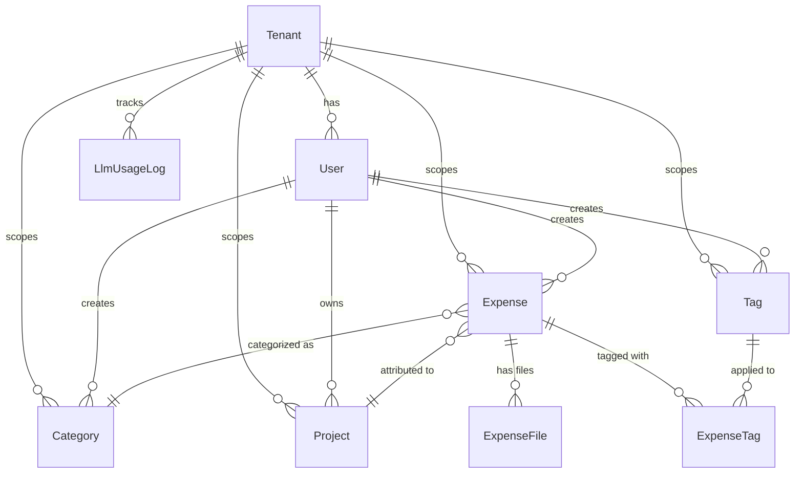

# Phase 0B — Core Data Model & Database

> **Rebaseline notice (2026-09-07)**: Phase 0B remains completed prototype history, but its target schema is superseded by [Phase 0I](phase-0i-polyglot-platform-rebaseline-design.md). Do not extend project tax fields, tenant dollar-budget fields, SQLAlchemy ownership, or the current Alembic baseline. Phase 0J creates a resettable TypeScript-owned schema with explicit `PersonalProfile`/`PersonalMembership` and `SmallBusiness`/`BusinessMembership` scopes, separate spending/tax categories, and business tax treatments.

> **Milestone**: 1 (Core Expense Management MVP)
> **Dependencies**: Phase 0A (Project Setup)
> **Estimated Effort**: 3-4 days

---

## Objective

Design and implement the core data model for the expense management system using SQLAlchemy 2.0 (asyncpg) / SQLModel and Alembic migrations, extending TaxHacker's entity structures with our multi-tenant, cloud storage, and knowledge graph additions.

---

## Data Model Design

### Core Entities (Implemented in `expense-service/app/models/` via SQLAlchemy 2.0 DeclarativeBase)

```python
import enum
import uuid
from datetime import datetime
from decimal import Decimal
from typing import List, Optional
from sqlalchemy import (
    String, Boolean, DateTime, Numeric, ForeignKey, Integer, Float,
    Enum as SQLEnum, Index, UniqueConstraint, func
)
from sqlalchemy.dialects.postgresql import UUID, JSONB, TSVECTOR
from sqlalchemy.orm import DeclarativeBase, Mapped, mapped_column, relationship
from pgvector.sqlalchemy import Vector

class Base(DeclarativeBase):
    pass

class ExpenseSource(str, enum.Enum):
    MANUAL = "MANUAL"
    EMAIL = "EMAIL"
    MANUAL_AND_EMAIL = "MANUAL_AND_EMAIL"

class ExpenseStatus(str, enum.Enum):
    PENDING = "PENDING"
    PROCESSING = "PROCESSING"
    REVIEW = "REVIEW"
    COMPLETED = "COMPLETED"
    DUPLICATE = "DUPLICATE"
    ERROR = "ERROR"

class Tenant(Base):
    __tablename__ = "tenants"

    id: Mapped[uuid.UUID] = mapped_column(UUID(as_uuid=True), primary_key=True, default=uuid.uuid4)
    name: Mapped[str] = mapped_column(String(255), nullable=False)
    slug: Mapped[str] = mapped_column(String(255), unique=True, nullable=False, index=True)
    created_at: Mapped[datetime] = mapped_column(DateTime(timezone=True), server_default=func.now())
    updated_at: Mapped[datetime] = mapped_column(DateTime(timezone=True), server_default=func.now(), onupdate=func.now())

    # LLM Budget Tracking
    llm_monthly_budget: Mapped[Optional[Decimal]] = mapped_column(Numeric(10, 2), nullable=True)
    llm_monthly_used: Mapped[Decimal] = mapped_column(Numeric(10, 2), default=Decimal("0.00"))
    llm_budget_reset_at: Mapped[Optional[datetime]] = mapped_column(DateTime(timezone=True), nullable=True)

    users: Mapped[List["User"]] = relationship("User", back_populates="tenant", cascade="all, delete-orphan")
    expenses: Mapped[List["Expense"]] = relationship("Expense", back_populates="tenant")
    categories: Mapped[List["Category"]] = relationship("Category", back_populates="tenant")
    projects: Mapped[List["Project"]] = relationship("Project", back_populates="tenant")
    tags: Mapped[List["Tag"]] = relationship("Tag", back_populates="tenant")
    llm_usage_logs: Mapped[List["LlmUsageLog"]] = relationship("LlmUsageLog", back_populates="tenant")

class User(Base):
    __tablename__ = "users"

    id: Mapped[uuid.UUID] = mapped_column(UUID(as_uuid=True), primary_key=True, default=uuid.uuid4)
    tenant_id: Mapped[uuid.UUID] = mapped_column(UUID(as_uuid=True), ForeignKey("tenants.id", ondelete="CASCADE"), nullable=False, index=True)
    email: Mapped[str] = mapped_column(String(255), unique=True, nullable=False, index=True)
    name: Mapped[str] = mapped_column(String(255), nullable=False)
    hashed_password: Mapped[str] = mapped_column(String(255), nullable=False)
    avatar: Mapped[Optional[str]] = mapped_column(String(1024), nullable=True)
    created_at: Mapped[datetime] = mapped_column(DateTime(timezone=True), server_default=func.now())
    updated_at: Mapped[datetime] = mapped_column(DateTime(timezone=True), server_default=func.now(), onupdate=func.now())

    tenant: Mapped["Tenant"] = relationship("Tenant", back_populates="users")
    expenses: Mapped[List["Expense"]] = relationship("Expense", back_populates="user")

class Expense(Base):
    __tablename__ = "expenses"

    id: Mapped[uuid.UUID] = mapped_column(UUID(as_uuid=True), primary_key=True, default=uuid.uuid4)
    tenant_id: Mapped[uuid.UUID] = mapped_column(UUID(as_uuid=True), ForeignKey("tenants.id", ondelete="CASCADE"), nullable=False, index=True)
    user_id: Mapped[uuid.UUID] = mapped_column(UUID(as_uuid=True), ForeignKey("users.id", ondelete="CASCADE"), nullable=False, index=True)

    source: Mapped[ExpenseSource] = mapped_column(SQLEnum(ExpenseSource), default=ExpenseSource.MANUAL, nullable=False)
    title: Mapped[Optional[str]] = mapped_column(String(255), nullable=True)
    description: Mapped[Optional[str]] = mapped_column(String, nullable=True)
    merchant: Mapped[Optional[str]] = mapped_column(String(255), nullable=True, index=True)
    amount: Mapped[Decimal] = mapped_column(Numeric(12, 2), nullable=False)
    currency: Mapped[str] = mapped_column(String(3), default="USD", nullable=False)
    converted_amount: Mapped[Optional[Decimal]] = mapped_column(Numeric(12, 2), nullable=True)
    base_currency: Mapped[str] = mapped_column(String(3), default="USD", nullable=False)
    date: Mapped[datetime] = mapped_column(DateTime(timezone=True), nullable=False, index=True)

    category_id: Mapped[Optional[uuid.UUID]] = mapped_column(UUID(as_uuid=True), ForeignKey("categories.id", ondelete="SET NULL"), nullable=True, index=True)
    project_id: Mapped[Optional[uuid.UUID]] = mapped_column(UUID(as_uuid=True), ForeignKey("projects.id", ondelete="SET NULL"), nullable=True, index=True)

    is_tax_deductible: Mapped[bool] = mapped_column(Boolean, default=False, nullable=False)
    tax_deduction_type: Mapped[Optional[str]] = mapped_column(String(50), nullable=True)
    tax_deduction_percent: Mapped[Optional[Decimal]] = mapped_column(Numeric(5, 2), nullable=True)

    ocr_raw_text: Mapped[Optional[str]] = mapped_column(String, nullable=True)
    ocr_confidence: Mapped[Optional[float]] = mapped_column(Float, nullable=True)
    ai_extracted_data: Mapped[Optional[dict]] = mapped_column(JSONB, nullable=True)
    line_items: Mapped[Optional[list]] = mapped_column(JSONB, nullable=True)

    status: Mapped[ExpenseStatus] = mapped_column(SQLEnum(ExpenseStatus), default=ExpenseStatus.PENDING, nullable=False)
    processed_at: Mapped[Optional[datetime]] = mapped_column(DateTime(timezone=True), nullable=True)

    # Search & Graph
    embedding = mapped_column(Vector(1536), nullable=True)
    search_vector = mapped_column(TSVECTOR, nullable=True)
    graph_node_id: Mapped[Optional[str]] = mapped_column(String(255), nullable=True)

    # Deduplication Hash (tenant-scoped)
    content_hash: Mapped[Optional[str]] = mapped_column(String(64), nullable=True, index=True)

    created_at: Mapped[datetime] = mapped_column(DateTime(timezone=True), server_default=func.now())
    updated_at: Mapped[datetime] = mapped_column(DateTime(timezone=True), server_default=func.now(), onupdate=func.now())

    tenant: Mapped["Tenant"] = relationship("Tenant", back_populates="expenses")
    user: Mapped["User"] = relationship("User", back_populates="expenses")
    category: Mapped[Optional["Category"]] = relationship("Category", back_populates="expenses")
    project: Mapped[Optional["Project"]] = relationship("Project", back_populates="expenses")
    files: Mapped[List["ExpenseFile"]] = relationship("ExpenseFile", back_populates="expense", cascade="all, delete-orphan")
    tags: Mapped[List["ExpenseTag"]] = relationship("ExpenseTag", back_populates="expense", cascade="all, delete-orphan")

    __table_args__ = (
        Index("ix_expenses_tenant_date", "tenant_id", "date"),
        Index("ix_expenses_tenant_category", "tenant_id", "category_id"),
        Index("ix_expenses_tenant_project", "tenant_id", "project_id"),
        Index("ix_expenses_tenant_content_hash", "tenant_id", "content_hash"),
    )

class ExpenseFile(Base):
    __tablename__ = "expense_files"

    id: Mapped[uuid.UUID] = mapped_column(UUID(as_uuid=True), primary_key=True, default=uuid.uuid4)
    expense_id: Mapped[Optional[uuid.UUID]] = mapped_column(UUID(as_uuid=True), ForeignKey("expenses.id", ondelete="CASCADE"), nullable=True, index=True)
    user_id: Mapped[uuid.UUID] = mapped_column(UUID(as_uuid=True), ForeignKey("users.id", ondelete="CASCADE"), nullable=False, index=True)

    original_filename: Mapped[str] = mapped_column(String(255), nullable=False)
    mime_type: Mapped[str] = mapped_column(String(100), nullable=False)
    file_size: Mapped[int] = mapped_column(Integer, nullable=False)

    local_path: Mapped[Optional[str]] = mapped_column(String(1024), nullable=True)
    cloud_storage_url: Mapped[Optional[str]] = mapped_column(String(1024), nullable=True)
    cloud_storage_key: Mapped[Optional[str]] = mapped_column(String(1024), nullable=True)
    thumbnail_url: Mapped[Optional[str]] = mapped_column(String(1024), nullable=True)

    ocr_text: Mapped[Optional[str]] = mapped_column(String, nullable=True)
    created_at: Mapped[datetime] = mapped_column(DateTime(timezone=True), server_default=func.now())
    updated_at: Mapped[datetime] = mapped_column(DateTime(timezone=True), server_default=func.now(), onupdate=func.now())

    expense: Mapped[Optional["Expense"]] = relationship("Expense", back_populates="files")

class Category(Base):
    __tablename__ = "categories"

    id: Mapped[uuid.UUID] = mapped_column(UUID(as_uuid=True), primary_key=True, default=uuid.uuid4)
    tenant_id: Mapped[uuid.UUID] = mapped_column(UUID(as_uuid=True), ForeignKey("tenants.id", ondelete="CASCADE"), nullable=False, index=True)
    name: Mapped[str] = mapped_column(String(100), nullable=False)
    color: Mapped[Optional[str]] = mapped_column(String(50), nullable=True)
    icon: Mapped[Optional[str]] = mapped_column(String(50), nullable=True)
    ai_prompt: Mapped[Optional[str]] = mapped_column(String, nullable=True)
    is_default: Mapped[bool] = mapped_column(Boolean, default=False, nullable=False)
    created_at: Mapped[datetime] = mapped_column(DateTime(timezone=True), server_default=func.now())

    tenant: Mapped["Tenant"] = relationship("Tenant", back_populates="categories")
    expenses: Mapped[List["Expense"]] = relationship("Expense", back_populates="category")

    __table_args__ = (UniqueConstraint("tenant_id", "name", name="uq_categories_tenant_name"),)

class Project(Base):
    __tablename__ = "projects"

    id: Mapped[uuid.UUID] = mapped_column(UUID(as_uuid=True), primary_key=True, default=uuid.uuid4)
    tenant_id: Mapped[uuid.UUID] = mapped_column(UUID(as_uuid=True), ForeignKey("tenants.id", ondelete="CASCADE"), nullable=False, index=True)
    name: Mapped[str] = mapped_column(String(100), nullable=False)
    description: Mapped[Optional[str]] = mapped_column(String, nullable=True)
    color: Mapped[Optional[str]] = mapped_column(String(50), nullable=True)
    business_type: Mapped[Optional[str]] = mapped_column(String(50), nullable=True)
    tax_year: Mapped[Optional[int]] = mapped_column(Integer, nullable=True)
    is_active: Mapped[bool] = mapped_column(Boolean, default=True, nullable=False)
    ai_prompt: Mapped[Optional[str]] = mapped_column(String, nullable=True)
    created_at: Mapped[datetime] = mapped_column(DateTime(timezone=True), server_default=func.now())

    tenant: Mapped["Tenant"] = relationship("Tenant", back_populates="projects")
    expenses: Mapped[List["Expense"]] = relationship("Expense", back_populates="project")

    __table_args__ = (UniqueConstraint("tenant_id", "name", name="uq_projects_tenant_name"),)

class Tag(Base):
    __tablename__ = "tags"

    id: Mapped[uuid.UUID] = mapped_column(UUID(as_uuid=True), primary_key=True, default=uuid.uuid4)
    tenant_id: Mapped[uuid.UUID] = mapped_column(UUID(as_uuid=True), ForeignKey("tenants.id", ondelete="CASCADE"), nullable=False, index=True)
    name: Mapped[str] = mapped_column(String(50), nullable=False)
    is_auto_generated: Mapped[bool] = mapped_column(Boolean, default=False, nullable=False)
    created_at: Mapped[datetime] = mapped_column(DateTime(timezone=True), server_default=func.now())

    tenant: Mapped["Tenant"] = relationship("Tenant", back_populates="tags")
    expense_tags: Mapped[List["ExpenseTag"]] = relationship("ExpenseTag", back_populates="tag", cascade="all, delete-orphan")

    __table_args__ = (UniqueConstraint("tenant_id", "name", name="uq_tags_tenant_name"),)

class ExpenseTag(Base):
    __tablename__ = "expense_tags"

    expense_id: Mapped[uuid.UUID] = mapped_column(UUID(as_uuid=True), ForeignKey("expenses.id", ondelete="CASCADE"), primary_key=True)
    tag_id: Mapped[uuid.UUID] = mapped_column(UUID(as_uuid=True), ForeignKey("tags.id", ondelete="CASCADE"), primary_key=True)
    confidence: Mapped[Optional[float]] = mapped_column(Float, nullable=True)

    expense: Mapped["Expense"] = relationship("Expense", back_populates="tags")
    tag: Mapped["Tag"] = relationship("Tag", back_populates="expense_tags")

class LlmUsageLog(Base):
    __tablename__ = "llm_usage_logs"

    id: Mapped[uuid.UUID] = mapped_column(UUID(as_uuid=True), primary_key=True, default=uuid.uuid4)
    tenant_id: Mapped[uuid.UUID] = mapped_column(UUID(as_uuid=True), ForeignKey("tenants.id", ondelete="CASCADE"), nullable=False, index=True)
    user_id: Mapped[Optional[uuid.UUID]] = mapped_column(UUID(as_uuid=True), ForeignKey("users.id", ondelete="SET NULL"), nullable=True)
    provider: Mapped[str] = mapped_column(String(50), nullable=False)
    model: Mapped[str] = mapped_column(String(100), nullable=False)
    prompt_tokens: Mapped[int] = mapped_column(Integer, default=0, nullable=False)
    completion_tokens: Mapped[int] = mapped_column(Integer, default=0, nullable=False)
    total_cost_usd: Mapped[Decimal] = mapped_column(Numeric(10, 4), nullable=False)
    operation: Mapped[str] = mapped_column(String(50), nullable=False)
    created_at: Mapped[datetime] = mapped_column(DateTime(timezone=True), server_default=func.now(), index=True)

    tenant: Mapped["Tenant"] = relationship("Tenant", back_populates="llm_usage_logs")

class DuplicateMatch(Base):
    __tablename__ = "duplicate_matches"

    id: Mapped[uuid.UUID] = mapped_column(UUID(as_uuid=True), primary_key=True, default=uuid.uuid4)
    tenant_id: Mapped[uuid.UUID] = mapped_column(UUID(as_uuid=True), ForeignKey("tenants.id", ondelete="CASCADE"), nullable=False, index=True)
    existing_expense_id: Mapped[uuid.UUID] = mapped_column(UUID(as_uuid=True), ForeignKey("expenses.id", ondelete="CASCADE"), nullable=False)
    candidate_expense_id: Mapped[uuid.UUID] = mapped_column(UUID(as_uuid=True), ForeignKey("expenses.id", ondelete="CASCADE"), nullable=False)
    match_type: Mapped[str] = mapped_column(String(50), nullable=False)  # "content_hash", "phash", "semantic", "order_number"
    confidence: Mapped[float] = mapped_column(Float, nullable=False)
    resolution: Mapped[str] = mapped_column(String(50), default="PENDING")  # "PENDING", "MERGED", "KEPT_BOTH", "DISCARDED"
    created_at: Mapped[datetime] = mapped_column(DateTime(timezone=True), server_default=func.now())
```

---

## Tasks

### 1. Design Entity Schema

- [ ] Finalize entity relationships based on model above (referencing TaxHacker entities)
- [ ] Add our extensions: multi-tenancy (`tenant_id`), tags, graph references, pgvector embeddings, `content_hash`
- [ ] Support extensible JSON custom fields

### 2. Implement SQLAlchemy 2.0 / SQLModel Models (`expense-service/app/models/`)

- [ ] Define Python models using SQLAlchemy 2.0 DeclarativeBase / SQLModel:
  - `Tenant`, `User`, `Expense`, `ExpenseFile`, `Category`, `Project`, `Tag`, `ExpenseTag`, `LlmUsageLog`
- [ ] Configure PostgreSQL-specific types:
  - `Vector(1536)` from `pgvector.sqlalchemy`
  - `TSVECTOR` for full-text search
  - `JSONB` for line items & raw OCR metadata
- [ ] Set up composite indexes (`tenant_id, date`, `tenant_id, category_id`, `content_hash`)

### 3. Alembic Migrations (`expense-service/alembic/`)

- [ ] Configure `alembic/env.py` with asyncpg engine and `target_metadata`
- [ ] Enable PostgreSQL extensions in migration script (`CREATE EXTENSION IF NOT EXISTS vector;`)
- [ ] Generate initial migration: `alembic revision --autogenerate -m "initial_schema"`
- [ ] Apply migration: `alembic upgrade head`

### 4. Database Seed Script (`expense-service/scripts/seed.py`)

- [ ] Create async Python seed script:
  - Seed initial Tenant ("Family")
  - Default categories (Food, Transportation, Office Supplies, Utilities, Travel, Healthcare, etc.)
  - Sample project ("Consulting LLC 2025")
  - Common tags (receipt, invoice, reimbursable, tax-deductible)
- [ ] Run seed via `python -m backend.scripts.seed`

### 5. Pydantic v2 Schemas & OpenAPI Type Generation

- [ ] Define Pydantic request/response models in `expense-service/app/schemas/` or shared `common/python/expense-contracts/` when reused across services:
  - `ExpenseCreate`, `ExpenseUpdate`, `ExpenseResponse`, `ExpenseListResponse`
  - `TenantResponse`, `CategoryResponse`, `ProjectResponse`
- [ ] Verify FastAPI auto-generates `openapi.json` at `/openapi.json`
- [ ] Configure script in `frontend/web/` to run `npx openapi-typescript http://localhost:8000/openapi.json -o src/lib/api-types.ts`

---

## Definition of Done

- [ ] SQLAlchemy models compile and connect via asyncpg to PostgreSQL 17
- [ ] Alembic initial migration executes cleanly on fresh database
- [ ] `pgvector` extension is active and stores 1536-dim embeddings
- [ ] Seed script successfully populates default family tenant and categories
- [ ] FastAPI `/docs` renders Swagger UI with complete Pydantic schemas
- [ ] Next.js client generates strict TypeScript types from OpenAPI schema

---

## Data Model Diagram



---

## Notes

- TaxHacker uses `Transaction` — we rename to `Expense` for clarity
- `Vector(1536)` handled via `pgvector.sqlalchemy`
- `content_hash` is SHA-256 of `(tenant_id + normalize(amount) + normalize(date) + normalize(merchant))` for tenant-wide dedup
- `graph_node_id` links SQL record to Neo4j / FalkorDB node for graph queries
- `LlmUsageLog` maintains an audit trail of LLM spending against the tenant's monthly budget
