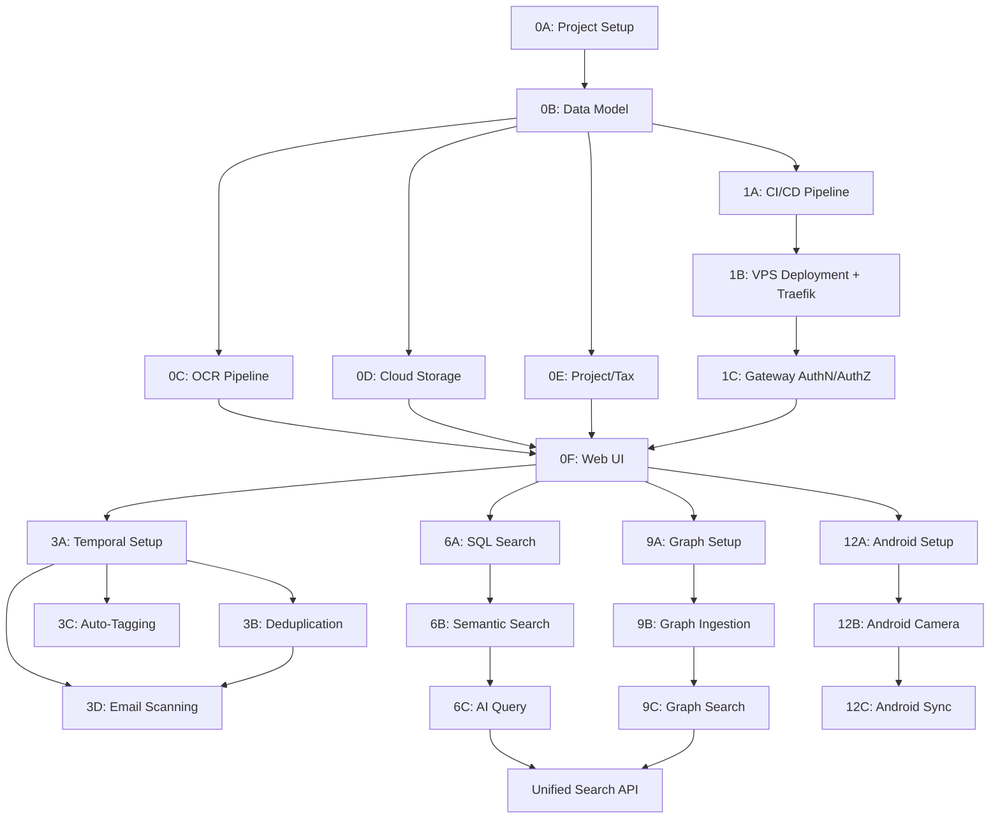

# 📋 Expense Tax Management — Master Plan

> **Project**: Expense Tax Management System (monorepo)
> **Inspired by**: [TaxHacker](https://github.com/vas3k/TaxHacker) (v0.8.5, Next.js + Prisma + PostgreSQL)
> **Status**: Planning Phase
> **Last Updated**: 2026-09-05

---

## 🎯 Vision

A self-hosted, AI-powered expense management system for freelancers and small businesses, enabling:
- **Receipt scanning** (OCR) via client-side web PWA (mobile-first) and future mobile app (evaluating Flutter for Android)
- **Structured data extraction** into a searchable database (JSON/CSV export)
- **Cloud file storage** (Google Cloud Storage) for receipt images & PDFs
- **Project-based tax deduction tracking** for small businesses
- **Multi-modal search**: exact filters, semantic search, AI natural-language - **Graph-based knowledge retrieval** for relational expense queries (e.g., _"Where is my Costco expense for the Hisense fridge I bought in 2025?"_)
- **Automated email receipt scanning** (Gmail) on a daily schedule to capture online orders, subscriptions, and digital receipts
- **Ingestion pipeline** with Temporal for deduplication (including cross-channel: manual scan ↔ email), auto-tagging, and enrichment

---

## 🏗️ Architecture Overview

```
┌─────────────────────────────────────────────────────────────────┐
│                    CLIENT LAYER (Presentation)                  │
│  ┌─────────────────────────────┐   ┌──────────────────────────┐ │
│  │  Next.js 16 Web App (PWA)   │   │  Flutter Mobile App      │ │
│  │  (Client-side PWA, Camera)  │   │  (Future Android/iOS M5) │ │
│  └──────────────┬──────────────┘   └────────────┬─────────────┘ │
└─────────────────┼───────────────────────────────┼───────────────┘
                  │                               │
                  ▼                               ▼
┌─────────────────────────────────────────────────────────────────┐
│                 INGRESS & GATEWAY (Traefik v3.3+)                │
│  ┌───────────────────────────────────────────────────────────┐  │
│  │  Traefik API Gateway                                       │  │
│  │  ├─ Route `/` → Next.js PWA                               │  │
│  │  ├─ Route `/api/` → FastAPI Python Backend                │  │
│  │  └─ ForwardAuth → JWT Validation → Identity Headers       │  │
│  └──────────────────────────────┬────────────────────────────┘  │
└─────────────────────────────────┼───────────────────────────────┘
                                  │
                                  ▼
┌─────────────────────────────────────────────────────────────────┐
│               CORE BACKEND LAYER (Python 3.14 / 3.13)           │
│  ┌───────────────────────────────────────────────────────────┐  │
│  │  FastAPI Application (Uvicorn, Pydantic v2)               │  │
│  │  ├─ Auth & Multi-Tenancy Middleware (JWT, Tenant Context) │  │
│  │  ├─ Expense, Project, Category CRUD APIs                  │  │
│  │  ├─ Search & AI Query Planner (SQL + pgvector + Cypher)   │  │
│  │  ├─ Native Graphiti Knowledge Graph Queries               │  │
│  │  ├─ LLM Monthly Budget Guard & Tracking                   │  │
│  │  └─ Temporal Workflow Client (Dispatches async jobs)      │  │
│  └──────────────┬───────────────────────────────┬────────────┘  │
└─────────────────┼───────────────────────────────┼───────────────┘
                  │                               │
                  ▼                               ▼
┌──────────────────────────────────────┐  ┌───────────────────────┐
│          PERSISTENCE LAYER           │  │  INGESTION & AGENTS   │
│  ┌──────────────┐ ┌──────────────┐   │  │  (Temporal Python)    │
│  │ PostgreSQL 17│ │ Neo4j 5.26+  │   │  │  ┌─────────────────┐  │
│  │ + pgvector   │ │ or FalkorDB  │   │  │  │ Temporal Worker │  │
│  │ (SQLAlchemy) │ │ (Graphiti)   │   │  │  │ ├─ PaddleOCR/LLM│  │
│  └──────────────┘ └──────────────┘   │  │  │ ├─ Gmail Scan   │  │
│  ┌───────────────────────────────┐   │  │  │ ├─ Deduplicate  │  │
│  │ Google Cloud Storage          │   │  │  │ ├─ Auto-Tag     │  │
│  │ (Receipt images & PDFs)       │   │  │  │ └─ Graph Ingest │  │
│  └───────────────────────────────┘   │  │  └─────────────────┘  │
└──────────────────────────────────────┘  └───────────────────────┘
```

---

## 🗂️ Milestones & Phases

### Milestone 0 — Core Expense Management (MVP) ⬅️ **CURRENT FOCUS**
> **Goal**: Get a working web app that can scan receipts, extract data, store files, and attribute expenses to projects.

| Phase | Description | Status | Sub-Plan |
|-------|-------------|--------|----------|
| **0A** | Project Bootstrap & Monorepo Setup | ✅ Complete | [phase-0a-project-setup.md](sub-plans/phase-0a-project-setup.md) |
| **0B** | Core Data Model & Database | ✅ Complete | [phase-0b-data-model.md](sub-plans/phase-0b-data-model.md) |
| **0C** | Receipt Upload & OCR Pipeline | 🟡 Current Focus | [phase-0c-ocr-pipeline.md](sub-plans/phase-0c-ocr-pipeline.md) |
| **0D** | Google Cloud Storage Integration | ⚪ Planned | [phase-0d-cloud-storage.md](sub-plans/phase-0d-cloud-storage.md) |
| **0E** | Project & Tax Deduction Management | ⚪ Planned | [phase-0e-project-tax.md](sub-plans/phase-0e-project-tax.md) |
| **0F** | Web App UI (Mobile-First) | ⚪ Planned | [phase-0f-web-ui.md](sub-plans/phase-0f-web-ui.md) |

---

### Milestone 1 — CI/CD, Deployment & API Gateway
> **Goal**: Automated CI/CD pipeline, reproducible VPS deployment via IaC, and centralized gateway-level AuthN/AuthZ with Traefik so all downstream services inherit security without custom auth code.

| Phase | Description | Status | Sub-Plan |
|-------|-------------|--------|----------|
| **1A** | GitHub Actions CI/CD Pipeline | ⚪ Planned | [phase-1a-cicd-pipeline.md](sub-plans/phase-1a-cicd-pipeline.md) |
| **1B** | Production VPS Deployment (Docker Compose + Traefik) | ⚪ Planned | [phase-1b-vps-deployment.md](sub-plans/phase-1b-vps-deployment.md) |
| **1C** | Gateway AuthN/AuthZ (Traefik ForwardAuth + JWT) | ⚪ Planned | [phase-1c-gateway-auth.md](sub-plans/phase-1c-gateway-auth.md) |

---

### Milestone 3 — Ingestion Pipeline, Email Scanning & Auto-Tagging
> **Goal**: Robust async ingestion with automated email receipt scanning, cross-channel deduplication, auto-tagging, and enrichment.

| Phase | Description | Sub-Plan |
|-------|-------------|----------|
| **3A** | Temporal Workflow Setup | [phase-3a-temporal-setup.md](sub-plans/phase-3a-temporal-setup.md) |
| **3B** | Deduplication & Conflict Resolution | [phase-3b-deduplication.md](sub-plans/phase-3b-deduplication.md) |
| **3C** | Auto-Tagging & Categorization Pipeline | [phase-3c-auto-tagging.md](sub-plans/phase-3c-auto-tagging.md) |
| **3D** | Automated Email Receipt Scanning (Gmail) | [phase-3d-email-scanning.md](sub-plans/phase-3d-email-scanning.md) |

---

### Milestone 6 — Search & AI Query
> **Goal**: Multi-modal search — exact filters, full-text, semantic (vector), and AI natural-language queries.

| Phase | Description | Sub-Plan |
|-------|-------------|----------|
| **6A** | SQL Filtering & Full-Text Search | [phase-6a-sql-search.md](sub-plans/phase-6a-sql-search.md) |
| **6B** | Semantic Search (pgvector) | [phase-6b-semantic-search.md](sub-plans/phase-6b-semantic-search.md) |
| **6C** | AI Query Interface (LLM-powered) | [phase-6c-ai-query.md](sub-plans/phase-6c-ai-query.md) |

---

### Milestone 9 — Graph RAG & Knowledge Graph
> **Goal**: Build a temporal knowledge graph of expenses for relational, contextual queries.

| Phase | Description | Sub-Plan |
|-------|-------------|----------|
| **9A** | Neo4j + Graphiti Setup | [phase-9a-graph-setup.md](sub-plans/phase-9a-graph-setup.md) |
| **9B** | Expense Graph Ingestion | [phase-9b-graph-ingestion.md](sub-plans/phase-9b-graph-ingestion.md) |
| **9C** | Graph Search & Query API | [phase-9c-graph-search.md](sub-plans/phase-9c-graph-search.md) |

---

### Milestone 12 — Mobile App (Deferred — PWA First)
> **Goal**: Dedicated mobile app targeting Android (and iOS). We may use Flutter for the Android app; we are not decided yet and it may not be Expo React Native. PWA in Phase 0F covers mobile scanning initially.

| Phase | Description | Sub-Plan |
|-------|-------------|----------|
| **12A** | Mobile App Architecture & Setup (Flutter evaluation for Android) | [phase-12a-android-setup.md](sub-plans/phase-12a-android-setup.md) |
| **12B** | Mobile Camera & Receipt Capture | [phase-12b-android-camera.md](sub-plans/phase-12b-android-camera.md) |
| **12C** | Mobile API Sync & Offline Mode | [phase-12c-android-sync.md](sub-plans/phase-12c-android-sync.md) |

---

## 🧰 Technology Stack (Python Backend + Next.js Client PWA)

| Layer | Technology | Version | Rationale |
|-------|-----------|---------|-----------|
| **Client Frontend** | Next.js (Client-side PWA) | **16.3+** | Mobile-first presentation layer, camera capture, installable PWA. Strictly client-side; consumes FastAPI backend via typed OpenAPI client. |
| **UI Library** | React | **19.2+** | Component state, optimistic UI updates, transitions |
| **Styling** | Tailwind CSS + Radix UI | **v4.3+** | CSS-first `@theme` engine, sleek dark mode, mobile responsiveness |
| **PWA Engine** | `@serwist/next` | Latest | Service Worker shell caching, offline receipts, camera permissions |
| **Core Backend API** | FastAPI (Python) | **0.120+** | High-speed async REST framework, native Pydantic v2 schemas |
| **Python Runtime** | Python | **3.14 / 3.13** | JIT performance, free-threading capability, AI library hub |
| **Database ORM** | SQLAlchemy 2.0 (asyncpg) / SQLModel | **2.0+** | Async PostgreSQL ORM with automatic tenant filtering |
| **DB Migrations** | Alembic | **1.14+** | Python database schema versioning and auto-generation |
| **Primary Database** | PostgreSQL + pgvector | **Postgres 17+** (`pgvector:pg17`) | ACID storage, native `tsvector` FTS, HNSW vector similarity |
| **Workflow Engine** | Temporal Python SDK + Server | **SDK 1.8+** / **Server 1.25+** | Native Python async workflows, daily cron schedules, retry logic |
| **Graph Framework** | Graphiti (`graphiti-core`) | **0.30.1+** | Native in-process Python integration, temporal knowledge graph |
| **Graph Database** | Neo4j Community / FalkorDB | **Neo4j 5.26+** / **FalkorDB** | Temporal relationship storage, direct Cypher queries via Python driver |
| **OCR & Vision AI** | PaddleOCR + OpenRouter / OpenAI | Latest | Native in-process PaddleOCR (zero-cost) or LLM vision with monthly budget cap |
| **Email Scanning** | Gmail API (`google-api-python-client`) | Latest | Automated daily background scans with Google OAuth2 verification |
| **File Storage** | Google Cloud Storage (`google-cloud-storage`) | **2.19+** | Scalable object storage, tenant-prefixed hierarchy, signed URLs |
| **Image Processing** | Pillow / OpenCV | Latest | In-process receipt deskewing, edge detection, and compression |
| **Gateway / Ingress** | Traefik | **v3.3+** | Docker-native API gateway with automatic HTTPS, ForwardAuth middleware for centralized AuthN/AuthZ, rate limiting, and zero-config service discovery via Docker labels |
| **Containerization** | Docker + Docker Compose | **Compose v2.33+** | Dev on macOS, Prod on Ubuntu self-hosted |
| **Future Mobile** | Flutter (Dart) | **3.27+** | Prime candidate for future Android app (single codebase for Android & iOS, native camera, undecided yet and may not be Expo React Native) |

---

## 📁 Monorepo Structure (Proposed)

```
expense-tax-management/
├── plans/                          # Master plan & sub-plans
│   ├── PLAN.md                     # ← Master Architecture & Roadmap
│   └── sub-plans/                  # Detailed phase specifications
├── apps/
│   ├── web/                        # Next.js 16 PWA (Client-Side Presentation Layer)
│   │   ├── app/                    # App Router pages & layouts
│   │   ├── components/             # React 19 UI components (Tailwind v4, Radix)
│   │   ├── lib/
│   │   │   ├── api.ts              # Typed API client generated from FastAPI OpenAPI
│   │   │   └── auth.ts             # Auth state and token management
│   │   ├── public/                 # PWA icons, manifest.json
│   │   └── package.json
│   └── mobile/                     # Future: Mobile client (evaluating Flutter for Android, M5)
├── backend/                        # Python 3.14 / 3.13 Backend & Workers
│   ├── app/                        # FastAPI Application
│   │   ├── api/                    # API Endpoints (v1: auth, expenses, projects, search)
│   │   ├── core/                   # Security, config, tenant context middleware
│   │   ├── models/                 # SQLAlchemy 2.0 / SQLModel database models
│   │   ├── schemas/                # Pydantic v2 schemas (generates OpenAPI spec)
│   │   ├── services/               # GCS storage, Graphiti engine, OCR service, budget guard
│   │   └── main.py                 # FastAPI application entrypoint
│   ├── workers/                    # Temporal Python Workers
│   │   ├── workflows/              # ExpenseIngestion, EmailScanWorkflow, AgentAuditor
│   │   ├── activities/             # PaddleOCR, GCS upload, Graphiti ingest, Gmail scan
│   │   └── worker.py               # Temporal worker entrypoint
│   ├── alembic/                    # Database migrations
│   ├── pyproject.toml              # Dependencies (FastAPI, Temporal, Graphiti, etc.)
│   └── Dockerfile                  # Python backend container
├── infrastructure/
│   ├── docker-compose.yml          # Local dev: PostgreSQL, FalkorDB, Temporal, FastAPI, Next.js, Traefik
│   ├── docker-compose.prod.yml     # Production (Ubuntu VPS)
│   ├── traefik/                    # Traefik gateway config
│   │   ├── traefik.yml              # Static config (ACME, Docker provider, dashboard)
│   │   └── dynamic/                 # Dynamic middleware definitions
│   └── scripts/                    # Deployment scripts for Ubuntu host
├── docs/                           # Architecture docs, ADRs
└── README.md
```

---

## 🔑 Key Design Decisions

### 1. Fork vs. Reference TaxHacker: Next.js Client-Side PWA + Python Backend
- **Decision**: Reference TaxHacker's UI/UX patterns, field ontology, and prompt design, but build the **backend natively in Python (FastAPI)** and keep **Next.js 16 strictly as a client-side presentation layer (PWA)**.
- **Client-Side Next.js Role**: The Next.js app is strictly the presentation layer. It manages UI state, mobile camera viewfinder/capture, responsive layouts, and PWA service workers. It communicates with the backend exclusively via typed REST calls against the FastAPI endpoints (generated via `openapi-typescript` from FastAPI's `/openapi.json`). Next.js has **no direct database connections, no ORM, and no backend workers**.
- **Python Backend Role**: All business logic, PostgreSQL persistence via SQLAlchemy 2.0 / Alembic, authentication / multi-tenancy context, OCR & AI extraction, GCS object management, Temporal async ingestion, and native Graphiti graph queries execute in Python.
- **What we adopt from TaxHacker**:
  - UI components and layout patterns (Radix UI + Tailwind)
  - Data model concepts (User, Expense, File, Category, Project)
  - Extraction prompts and receipt field structures

### 2. Graph RAG: Native Python Graphiti
- **Decision**: Run [Graphiti](https://github.com/getzep/graphiti) **natively in Python** inside the FastAPI backend and Temporal Python workers.
- **Rationale**: No separate sidecar microservice needed! Graphiti (`graphiti-core`) is imported directly in Python. Fast direct Cypher reads against Neo4j or FalkorDB are executed using the native Python driver.
- **Graph DB choice**: Follow Graphiti's preferred backend (currently Neo4j 5.26+ or FalkorDB).

### 3. Search Architecture (Layered)
- **Layer 1 — SQL Filters**: PostgreSQL exact filters (date, amount, category, project, tags) via SQLAlchemy
- **Layer 2 — Full-Text Search**: PostgreSQL `tsvector` for keyword search in receipt text
- **Layer 3 — Semantic Search**: pgvector embeddings for similarity search ("expenses like my office supplies")
- **Layer 4 — Graph Search**: Graphiti/Neo4j for relational queries ("What did I buy at Costco for my home office?")
- **Layer 5 — AI Query**: LLM rewrites natural language → structured query plan dispatched to layers 1-4

### 4. Ingestion Pipeline: Temporal Python SDK (Self-Hosted Docker)
- **Decision**: Use the **Temporal Python SDK** (`temporalio`) running async workflows, self-hosted via Docker on Ubuntu.
- **Rationale**: All activities (PaddleOCR, LLM vision, GCS upload, deduplication, and Graphiti graph ingestion) execute natively in Python with direct database access via SQLAlchemy. Zero inter-process serialization overhead.

### 5. Email Receipt Scanning: Gmail API in Python + Temporal Cron
- **Decision**: Gmail API via official Google API Python client, scheduled via Temporal Python cron workflows.
- **Rationale**: Cross-channel dedup: when a user scans a receipt manually and the same receipt arrives via email, the system detects the duplicate via tenant-scoped content hash and links the email to the existing expense.

### 6. File Storage: Google Cloud Storage
- **Decision**: GCS over local filesystem
- **Rationale**: Scalable, CDN-ready, handles large receipts/PDFs, lifecycle policies for cost management
- **Local dev**: Can use GCS emulator or fall back to local filesystem

### 7. Multi-Tenancy from Day One
- **Decision**: Build as multi-tenant from the start, with tenant isolation at the data layer. First tenant: family account.
- **Rationale**: Avoids costly refactor later. Traefik gateway + Docker Compose architecture is already microservice-ready.
- **Implementation**: Each user belongs to a `tenant`. Data queries are always tenant-scoped. Auth includes tenant context.
- **Future**: If commercialized, add tenant management, billing, and per-tenant resource limits.

### 8. Deployment: Ubuntu Self-Hosted + Docker
- **Decision**: All services (Next.js, PostgreSQL, FalkorDB, Temporal, Graphiti, Traefik) run via Docker Compose on an Ubuntu VPS.
- **Dev**: macOS (this MacBook) with Docker Desktop
- **Prod**: OVH VPS (12 GB RAM), portable to any VPS provider via IaC (see [ROADMAP.md](ROADMAP.md)). No fixed cloud costs.
- **Gateway**: Traefik API gateway in front of all services for routing, automatic TLS, gateway-level AuthN/AuthZ (ForwardAuth), rate limiting, and zero-config Docker service discovery.

### 9. OCR/LLM Strategy
- **Decision**: Always use LLM for OCR extraction (no Tesseract fallback). Provider TBD between OpenRouter, OpenAI, and PaddleOCR.
- **Budget**: Implement monthly LLM budget cap per tenant with warnings at 80% and hard stop at 100%.
- **Not using**: Gemini Flash. Final model provider decision deferred to implementation.

### 10. Mobile Strategy: Next.js PWA First, Flutter Candidate for Future Android App
- **Decision**: Build the web app as a client-side **PWA (Progressive Web App)** with camera access for receipt scanning on mobile. In the future (Milestone 12), for a dedicated mobile app, we **may use Flutter for the Android app (and may not be Expo React Native, as we are not decided yet)**.
- **PWA capabilities**: HTML5 camera capture (`getUserMedia` and `<input capture="environment">`), offline indicator, home screen install, push notifications.
- **Flutter consideration**: Because our backend is Python, React Native lacks its traditional benefit of sharing TypeScript code with the backend. Flutter provides high-performance 60/120fps rendering, first-class camera/document-scanning plugins (e.g., `google_mlkit_document_scanner`), cross-platform support from a single Dart codebase, and robust offline caching via `sqflite`/`isar`. The final framework choice remains open until Milestone 12 begins, but Flutter is positioned as the primary candidate.

### 11. Gmail OAuth: Full Verification
- **Decision**: Pursue full Google OAuth verification from the start. Existing GCP project and OAuth client already set up.
- **Timeline**: Verification takes 2-6 weeks; start the process during Milestone 3 development.

### 12. Email Scan Depth
- **Decision**: Default to **last 30 days** on first connect. User can choose a custom range, capped at **90 days maximum**.
- **Rationale**: 30 days balances coverage vs. LLM cost. 90-day cap prevents runaway costs on first connect.

---

## ✅ Resolved Decisions (formerly Open Questions)

| # | Question | Decision |
|---|----------|----------|
| 1 | Backend Architecture & Graphiti | **Python (FastAPI)** as the core backend with **native in-process Graphiti**. Next.js 16 is the dedicated client-side PWA. |
| 2 | Temporal hosting & SDK | **Temporal Python SDK** (`temporalio`) self-hosted via Docker on Ubuntu. |
| 3 | LLM/OCR strategy | **Always LLM or native PaddleOCR** (OpenRouter / OpenAI / PaddleOCR). No Gemini Flash. Monthly LLM budget cap per tenant. |
| 4 | Multi-tenancy | **Multi-tenant from day one**. Tenant-scoped data isolation via FastAPI middleware & SQLAlchemy. First tenant: family. |
| 5 | Mobile strategy | **Next.js PWA first**; future mobile app (M12) evaluating **Flutter** for Android (may not be Expo React Native, undecided). |
| 6 | Gmail OAuth | **Full Google OAuth verification** using Google API Python SDK. Existing GCP project & OAuth client already configured. |
| 7 | Email scan depth | **Default 30 days**, user-choosable, **max 90 days**. Balances coverage vs. LLM classification cost. |

## ⚠️ Remaining Risks

1. **LLM provider selection**: Final OCR model provider (OpenRouter vs. OpenAI vs. PaddleOCR) to be prototyped. (PaddleOCR risk is now mitigated since backend is natively in Python).
2. **Graphiti maturity**: Graphiti is evolving actively (`graphiti-core` 0.30+). Running in-process Python allows easy version upgrades.
3. **OAuth verification timeline**: Google verification can take 2-6 weeks.

---

## 📊 Priority & Dependencies



---

## 📎 References

- [TaxHacker Repository](https://github.com/vas3k/TaxHacker) — Base reference for web app features
- [Graphiti Repository](https://github.com/getzep/graphiti) — Temporal knowledge graph framework
- [Graphiti Paper](https://arxiv.org/abs/2501.13956) — Zep temporal knowledge graph architecture
- [Temporal.io](https://temporal.io/) — Workflow orchestration engine
- [pgvector](https://github.com/pgvector/pgvector) — PostgreSQL vector similarity search
- [Google Cloud Storage Python Client](https://cloud.google.com/python/docs/reference/storage/latest)
- [Gmail API Python Client](https://developers.google.com/gmail/api/quickstart/python)
- [google-api-python-client](https://github.com/googleapis/google-api-python-client)
- [Flutter Documentation](https://flutter.dev/docs)
