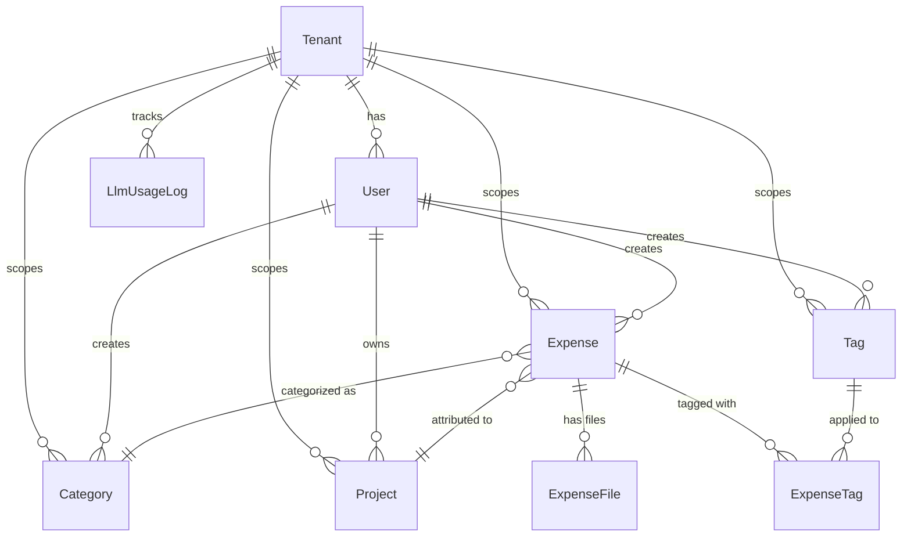

# Phase 1B — Core Data Model & Database

> **Milestone**: 1 (Core Expense Management MVP)
> **Dependencies**: Phase 1A (Project Setup)
> **Estimated Effort**: 3-4 days

---

## Objective

Design and implement the core data model for the expense management system using SQLAlchemy 2.0 (asyncpg) / SQLModel and Alembic migrations, extending TaxHacker's entity structures with our multi-tenant, cloud storage, and knowledge graph additions.

---

## Data Model Design

### Core Conceptual Entities (Implemented in `backend/app/models/` via SQLAlchemy 2.0 / SQLModel)

```prisma
// ─── Tenant (multi-tenancy from day one) ───
model Tenant {
  id                  String         @id @default(uuid()) @db.Uuid
  name                String         // e.g., "Family", "My LLC"
  slug                String         @unique // URL-safe identifier
  users               User[]
  expenses            Expense[]
  categories          Category[]
  projects            Project[]
  tags                Tag[]
  createdAt           DateTime       @default(now())
  updatedAt           DateTime       @updatedAt

  // LLM budget management
  llmMonthlyBudget    Decimal?       @db.Decimal(10, 2) // Monthly LLM spending cap (USD)
  llmMonthlyUsed      Decimal        @default(0) @db.Decimal(10, 2) // Current month usage (USD)
  llmBudgetResetAt    DateTime?      // When to reset the counter (1st of month)
  llmUsageLogs        LlmUsageLog[]

  @@map("tenants")
}

// ─── User ───
model User {
  id                  String         @id @default(uuid()) @db.Uuid
  tenantId            String         @db.Uuid
  tenant              Tenant         @relation(fields: [tenantId], references: [id])
  email               String         @unique
  name                String
  avatar              String?
  settings            Setting[]
  categories          Category[]
  projects            Project[]
  fields              Field[]
  expenses            Expense[]
  tags                Tag[]
  createdAt           DateTime       @default(now())
  updatedAt           DateTime       @updatedAt

  @@index([tenantId])
  @@map("users")
}

// ─── Expense (was "Transaction" in TaxHacker) ───
model Expense {
  id                  String         @id @default(uuid()) @db.Uuid
  tenantId            String         @db.Uuid
  tenant              Tenant         @relation(fields: [tenantId], references: [id])
  userId              String         @db.Uuid
  user                User           @relation(fields: [userId], references: [id])

  // Ingestion Source
  source              ExpenseSource  @default(MANUAL) // MANUAL, EMAIL, MANUAL_AND_EMAIL

  // Core fields
  title               String?        // AI-extracted or user-provided
  description         String?        // Full OCR text content
  merchant            String?        // Store/vendor name
  amount              Decimal        @db.Decimal(12, 2)
  currency            String         @default("USD")
  convertedAmount     Decimal?       @db.Decimal(12, 2)
  baseCurrency        String         @default("USD")
  date                DateTime       // Transaction date
  
  // Classification
  categoryId          String?        @db.Uuid
  category            Category?      @relation(fields: [categoryId], references: [id])
  projectId           String?        @db.Uuid
  project             Project?       @relation(fields: [projectId], references: [id])
  
  // Tax deduction
  isTaxDeductible     Boolean        @default(false)
  taxDeductionType    String?        // e.g., "business_expense", "home_office", "travel"
  taxDeductionPercent Decimal?       @db.Decimal(5, 2) // % deductible (0-100)
  
  // Tags & Labels
  tags                ExpenseTag[]
  
  // Files
  files               ExpenseFile[]
  
  // AI/OCR metadata
  ocrRawText          String?        // Raw OCR output
  ocrConfidence       Float?         // OCR confidence score
  aiExtractedData     Json?          // Full AI extraction JSON
  lineItems           Json?          // Individual items array
  
  // Processing status
  status              ExpenseStatus  @default(PENDING)
  processedAt         DateTime?
  
  // Search
  embedding           Unsupported("vector(1536)")? // pgvector for semantic search
  searchVector        Unsupported("tsvector")?      // PostgreSQL FTS
  
  // Graph reference
  graphNodeId         String?        // Reference to Neo4j node ID
  
  // Deduplication
  contentHash         String?        // Hash for duplicate detection (tenant-scoped)
  
  createdAt           DateTime       @default(now())
  updatedAt           DateTime       @updatedAt

  @@index([tenantId, date])
  @@index([tenantId, categoryId])
  @@index([tenantId, projectId])
  @@index([userId, date])
  @@index([contentHash])
  @@map("expenses")
}

enum ExpenseStatus {
  PENDING       // Uploaded, not yet processed
  PROCESSING    // OCR/AI extraction in progress
  REVIEW        // Needs user review
  COMPLETED     // Fully processed
  DUPLICATE     // Marked as duplicate
  ERROR         // Processing failed
}

enum ExpenseSource {
  MANUAL            // Uploaded via web camera / file picker
  EMAIL             // Ingested via daily Gmail scan
  MANUAL_AND_EMAIL  // Merged: manual scan enriched with email data
}

// ─── Files (receipts, invoices) ───
model ExpenseFile {
  id                  String         @id @default(uuid()) @db.Uuid
  expenseId           String?        @db.Uuid
  expense             Expense?       @relation(fields: [expenseId], references: [id])
  userId              String         @db.Uuid

  originalFilename    String
  mimeType            String         // image/jpeg, application/pdf, etc.
  fileSize            Int            // bytes
  
  // Storage
  localPath           String?        // Temporary local path
  cloudStorageUrl     String?        // GCS URL: gs://bucket/path
  cloudStorageKey     String?        // GCS object key
  thumbnailUrl        String?        // Generated thumbnail URL
  
  // Processing
  ocrText             String?        // Extracted text from this file
  
  createdAt           DateTime       @default(now())
  updatedAt           DateTime       @updatedAt

  @@index([expenseId])
  @@index([userId])
  @@map("expense_files")
}

// ─── Category ───
model Category {
  id                  String         @id @default(uuid()) @db.Uuid
  tenantId            String         @db.Uuid
  tenant              Tenant         @relation(fields: [tenantId], references: [id])
  userId              String         @db.Uuid
  user                User           @relation(fields: [userId], references: [id])
  name                String
  color               String?
  icon                String?
  aiPrompt            String?        // Custom AI prompt for categorization
  isDefault           Boolean        @default(false)
  expenses            Expense[]
  createdAt           DateTime       @default(now())

  @@unique([tenantId, name])
  @@map("categories")
}

// ─── Project (for tax deduction grouping) ───
model Project {
  id                  String         @id @default(uuid()) @db.Uuid
  tenantId            String         @db.Uuid
  tenant              Tenant         @relation(fields: [tenantId], references: [id])
  userId              String         @db.Uuid
  user                User           @relation(fields: [userId], references: [id])
  name                String
  description         String?
  color               String?
  businessType        String?        // e.g., "LLC", "sole_proprietorship"
  taxYear             Int?
  isActive            Boolean        @default(true)
  aiPrompt            String?        // Custom AI prompt for project attribution
  expenses            Expense[]
  createdAt           DateTime       @default(now())

  @@unique([tenantId, name])
  @@map("projects")
}

// ─── Tag ───
model Tag {
  id                  String         @id @default(uuid()) @db.Uuid
  tenantId            String         @db.Uuid
  tenant              Tenant         @relation(fields: [tenantId], references: [id])
  userId              String         @db.Uuid
  user                User           @relation(fields: [userId], references: [id])
  name                String
  isAutoGenerated     Boolean        @default(false) // AI-generated vs user-created
  expenses            ExpenseTag[]
  createdAt           DateTime       @default(now())

  @@unique([tenantId, name])
  @@map("tags")
}

model ExpenseTag {
  expenseId           String         @db.Uuid
  expense             Expense        @relation(fields: [expenseId], references: [id])
  tagId               String         @db.Uuid
  tag                 Tag            @relation(fields: [tagId], references: [id])
  confidence          Float?         // AI confidence for auto-tags

  @@id([expenseId, tagId])
  @@map("expense_tags")
}

// ─── LLM Usage Log (Budget tracking & audit) ───
model LlmUsageLog {
  id                  String         @id @default(uuid()) @db.Uuid
  tenantId            String         @db.Uuid
  tenant              Tenant         @relation(fields: [tenantId], references: [id])
  userId              String?        @db.Uuid
  provider            String         // "openrouter", "openai", "paddleocr"
  model               String         // e.g. "gpt-4o-mini", "anthropic/claude-3.5-haiku"
  promptTokens        Int            @default(0)
  completionTokens    Int            @default(0)
  totalCostUsd        Decimal        @db.Decimal(10, 4)
  operation           String         // "ocr_extraction", "auto_tag", "ai_query", "email_classify"
  createdAt           DateTime       @default(now())

  @@index([tenantId, createdAt])
  @@map("llm_usage_logs")
}
```

---

## Tasks

### 1. Design Entity Schema

- [ ] Finalize entity relationships based on model above (referencing TaxHacker entities)
- [ ] Add our extensions: multi-tenancy (`tenant_id`), tags, graph references, pgvector embeddings, `content_hash`
- [ ] Support extensible JSON custom fields

### 2. Implement SQLAlchemy 2.0 / SQLModel Models (`backend/app/models/`)

- [ ] Define Python models using SQLAlchemy 2.0 DeclarativeBase / SQLModel:
  - `Tenant`, `User`, `Expense`, `ExpenseFile`, `Category`, `Project`, `Tag`, `ExpenseTag`, `LlmUsageLog`
- [ ] Configure PostgreSQL-specific types:
  - `Vector(1536)` from `pgvector.sqlalchemy`
  - `TSVECTOR` for full-text search
  - `JSONB` for line items & raw OCR metadata
- [ ] Set up composite indexes (`tenant_id, date`, `tenant_id, category_id`, `content_hash`)

### 3. Alembic Migrations (`backend/alembic/`)

- [ ] Configure `alembic/env.py` with asyncpg engine and `target_metadata`
- [ ] Enable PostgreSQL extensions in migration script (`CREATE EXTENSION IF NOT EXISTS vector;`)
- [ ] Generate initial migration: `alembic revision --autogenerate -m "initial_schema"`
- [ ] Apply migration: `alembic upgrade head`

### 4. Database Seed Script (`backend/scripts/seed.py`)

- [ ] Create async Python seed script:
  - Seed initial Tenant ("Family")
  - Default categories (Food, Transportation, Office Supplies, Utilities, Travel, Healthcare, etc.)
  - Sample project ("Consulting LLC 2025")
  - Common tags (receipt, invoice, reimbursable, tax-deductible)
- [ ] Run seed via `python -m backend.scripts.seed`

### 5. Pydantic v2 Schemas & OpenAPI Type Generation

- [ ] Define Pydantic request/response models in `backend/app/schemas/`:
  - `ExpenseCreate`, `ExpenseUpdate`, `ExpenseResponse`, `ExpenseListResponse`
  - `TenantResponse`, `CategoryResponse`, `ProjectResponse`
- [ ] Verify FastAPI auto-generates `openapi.json` at `/openapi.json`
- [ ] Configure script in `apps/web/` to run `npx openapi-typescript http://localhost:8000/openapi.json -o src/lib/api-types.ts`

---

## Definition of Done

- [ ] SQLAlchemy models compile and connect via asyncpg to PostgreSQL 17
- [ ] Alembic initial migration executes cleanly on fresh database
- [ ] `pgvector` extension is active and stores 1536-dim embeddings
- [ ] Seed script successfully populates default family tenant and categories
- [ ] FastAPI `/docs` renders Swagger UI with complete Pydantic schemas
- [ ] Next.js client generates strict TypeScript types from OpenAPI schema

---

## Data Model Diagram



---

## Notes

- TaxHacker uses `Transaction` — we rename to `Expense` for clarity
- `Vector(1536)` handled via `pgvector.sqlalchemy`
- `content_hash` is SHA-256 of `(tenant_id + normalize(amount) + normalize(date) + normalize(merchant))` for tenant-wide dedup
- `graph_node_id` links SQL record to Neo4j / FalkorDB node for graph queries
- `LlmUsageLog` maintains an audit trail of LLM spending against the tenant's monthly budget
